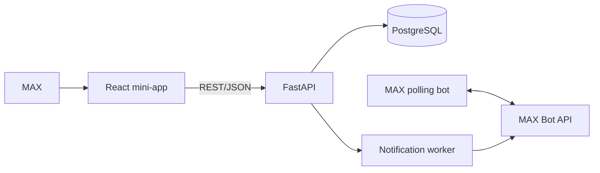

# Приют

«Приют» - мини-приложение и чат-бот в MAX для обмена гостеприимством во время поездок по России. Путешественник находит хозяина, отправляет запрос и после предварительного одобрения получает контакт для общения в MAX.

- Мини-приложение: <https://64.188.79.42>
- Бот: <https://max.ru/t134_hakaton_max_bot?startapp=home>
- API: <https://64.188.79.42/docs>

## Основной сценарий

1. Пользователь открывает мини-приложение из бота MAX.
2. Заполняет профиль и выбирает город.
3. Ищет предложение по городу, датам, числу гостей и типу размещения.
4. Отправляет хозяину запрос.
5. Хозяин получает уведомление в MAX и принимает или отклоняет запрос.
6. После принятия участники видят контакт и могут продолжить общение в MAX. После взаимодействия можно оставить отзыв.

Предварительное одобрение не является бронированием и не гарантирует проживание.

## Архитектура



| Компонент | Назначение | Стек |
|---|---|---|
| `frontend` | Интерфейс мини-приложения | React 19, TypeScript, Vite, nginx |
| `backend` | Авторизация MAX, профили, каталог, запросы, отзывы | Python 3.13, FastAPI, SQLAlchemy |
| `db` | Основные данные и очередь уведомлений | PostgreSQL 17, Alembic |
| `bot` | `/start`, `/help`, кнопка запуска mini-app | MAX Bot API, long polling |
| `notifications` | Доставка уведомлений о запросах и отзывах | Python worker, MAX Bot API |

## Запуск в Docker

Нужны Docker Engine с Compose v2 и доступ в интернет. MAX Bot API нельзя воспроизвести внутри Docker: для авторизации, бота и уведомлений нужен токен бота, выданный организаторами.

```bash
cp .env.example .env
```

В `.env` задайте `POSTGRES_PASSWORD`, `MAX_BOT_TOKEN`, `MAX_BOT_USERNAME` и `MAX_MINI_APP_ENABLED=true`. Для сквозной проверки реальных MAX-уведомлений также установите `NOTIFICATION_DELIVERY_ENABLED=true`. Не коммитьте `.env`.

Одна команда запускает все локальные компоненты:

```bash
docker compose up --build -d
```

При первом старте backend автоматически применяет миграции, импортирует справочник населённых пунктов и загружает синтетический демо-набор. Отдельная команда seed для обычной проверки не нужна.

Проверка запуска:

```bash
docker compose ps
curl http://localhost:8000/api/health/ready
```

Ожидаемый ответ: HTTP `200`, `{"status":"ready"}`. Интерфейс доступен на <http://localhost:8080>, API - на <http://localhost:8000>.

### Переменные окружения

| Переменная | Назначение | Обязательна |
|---|---|---|
| `POSTGRES_USER`, `POSTGRES_DB` | Параметры PostgreSQL | Нет, есть значения по умолчанию |
| `POSTGRES_PASSWORD` | Пароль PostgreSQL | Да |
| `MAX_BOT_TOKEN` | Токен бота для initData и Bot API | Да для проверки в MAX |
| `MAX_BOT_USERNAME` | Username бота | Да для кнопок и deep links |
| `MAX_MINI_APP_ENABLED` | Включает кнопку mini-app | Нет, по умолчанию `false` |
| `COOKIE_SECURE` | Secure-cookie для HTTPS | Нет, локально `false` |
| `ALLOWED_ORIGINS` | JSON-список разрешённых origin | Нет |
| `BACKEND_PORT`, `WEB_PORT` | Порты хоста | Нет, `8000` и `8080` |
| `NOTIFICATION_DELIVERY_ENABLED` | Фактическая отправка MAX-уведомлений | Нет, по умолчанию `false` |

Полный шаблон с безопасными пустыми значениями находится в [`.env.example`](.env.example). Настройки worker также описаны там.

### Порты

| Сервис | Хост | Контейнер |
|---|---:|---:|
| Web | `127.0.0.1:8080` | `80` |
| Backend | `127.0.0.1:8000` | `8000` |
| PostgreSQL | не публикуется | `5432` |

## Данные и тестовое наполнение

Основные данные хранятся в PostgreSQL. Схема создаётся Alembic-миграциями. Справочник населённых пунктов - зафиксированный снимок официального ГАР/ФИАС от 24.09.2026. Это справочные, а не тестовые данные.

> **Явное указание для проверки:** каталог, запросы, отзывы и уведомления, которые автоматически загружаются при старте Docker, полностью синтетические. Они не получены из внешней информационной системы и не являются реальными аккаунтами MAX. Карточки помечены тегом **«Демо-данные»**.

Набор нужен только для того, чтобы жюри сразу увидело заполненный интерфейс. В нём 9 вымышленных профилей, 6 предложений, 5 запросов, 6 отзывов и 5 уведомлений. Повторный старт обновляет только этот детерминированный набор и не очищает данные жюри.

Заранее заданные логины, пароли или два «демо-аккаунта» не нужны. Жюри входит со своих аккаунтов MAX. Для сквозной проверки запроса и одобрения можно использовать любые два реальных аккаунта MAX.

## Пошаговая проверка

1. Откройте бота в MAX, нажмите «Открыть Приют» и заполните профиль.
2. Откройте каталог. Ожидается набор карточек с меткой «Демо-данные».
3. Проверьте фильтры города, дат, числа гостей и типа размещения. Каталог должен показывать только подходящие варианты.
4. Отправьте запрос на подходящие даты. Ожидается статус `pending` и уведомление хозяину.
5. Со второго аккаунта MAX создайте своё предложение, примите запрос и проверьте, что контакт доступен обоим участникам.
6. Оставьте отзыв. Ожидается обновление рейтинга и уведомление второму участнику.

Некорректные даты и пустые обязательные поля должны давать понятную ошибку. После ошибки сценарий можно продолжить без перезапуска.

## Собственный API

К решению относятся требования для «решений с собственным API»: React-клиент работает с вашим FastAPI backend, а production API доступен по HTTPS.

- базовый адрес: <https://64.188.79.42>;
- OpenAPI 3.1: [`docs/openapi.json`](docs/openapi.json);
- конфигурация API Judge 1.0: [`DATA-API.yaml`](DATA-API.yaml).

Защищённые API-методы не имеют отдельного логина и пароля: авторизация выполняется по подписанному `initData` MAX. Для роли `user` в API Judge нужно передать временный `Authorization: Bearer <session-token>` через закрытую форму проверки или служебный первый слайд. Рабочий session token нельзя публиковать в Git.

## Зависимости и внешние сервисы

Версии Python-зависимостей зафиксированы в [`backend/requirements.txt`](backend/requirements.txt), frontend-зависимостей - в [`frontend/package-lock.json`](frontend/package-lock.json). Системные зависимости фиксированы базовыми Docker-образами.

Внешние сервисы:

- MAX Platform/Bot API - вход, запуск mini-app, сообщения и уведомления;
- ГАР/ФИАС - источник зафиксированного в репозитории справочника; онлайн-подключение при работе MVP не используется.

Закрытые библиотеки, частные API и чужой нелицензионный код не используются.

## Известные ограничения

- Основной сценарий полноценно работает только в MAX, где есть подписанный `initData`.
- Для уведомлений оба участника должны заранее запустить бота.
- Нет бронирования, оплаты, автоматической проверки личности и модерации.
- После принятия запроса даты не блокируются автоматически.
- Загрузка отдельного фото профиля не реализована; используется фото MAX.
- Редкий сетевой сбой между отправкой и фиксацией результата может привести к повторному MAX-сообщению.

## Остановка и повторный запуск

```bash
docker compose down
docker compose up --build -d
```

`docker compose down` сохраняет PostgreSQL и курсор бота в Docker volumes. Команда `docker compose down -v` удаляет локальную БД и состояние бота.

## Проверки для разработчиков

```bash
npm --prefix frontend run build
npm --prefix frontend run lint
node --experimental-strip-types --test frontend/tests/*.test.mjs
backend/.venv/bin/python -m pytest -q
backend/.venv/bin/python scripts/export_openapi.py --check
```

Тесты PostgreSQL требуют отдельную БД, имя которой оканчивается на `_test`. Полная автоматизированная проверка из корня: `python3 scripts/check_backend.py`.
