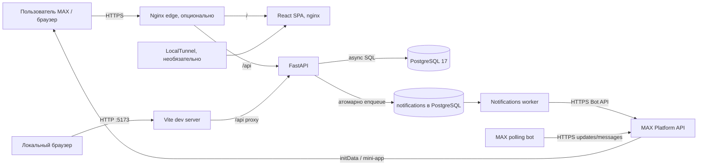
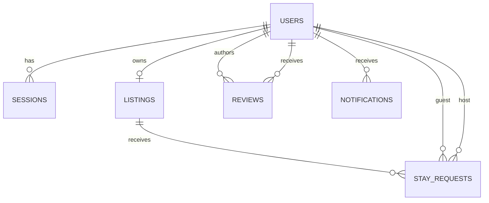

## 1. Название и краткое описание

«Приют» — backend API и MAX mini-app для hospitality exchange: профилей, предложений размещения, запросов на общение, отзывов и уведомлений. Реализованы отдельные процессы FastAPI, MAX polling-бота и worker доставки уведомлений.

**Тип репозитория:** monorepo с frontend, backend и deployment-конфигурацией. Backend — единое приложение, запускаемое несколькими процессами/контейнерами.

## 2. Архитектура



| Компонент | Путь | Назначение | Стек | Точка входа |
|---|---|---|---|---|
| API | `backend/app/` | Авторизация MAX, профили, каталог, запросы, отзывы, уведомления, health | Python 3.13, FastAPI, SQLAlchemy async | `app.main:create_app` |
| Frontend | `frontend/src/` | MAX mini-app / React SPA | Node 26 для сборки, React, TypeScript, Vite | `src/main.tsx` → `src/App.tsx` |
| PostgreSQL | `compose.yaml` | Основные данные и таблица очереди уведомлений | PostgreSQL 17 | Образ `postgres:17` |
| MAX polling bot | `backend/app/max_bot/` | Обработка `bot_started`, `/start`, `/help` | Python, httpx, MAX Bot API | `python -m app.max_bot.polling` |
| Notifications worker | `backend/app/workers/notifications.py` | Доставка уведомлений в MAX с повторами | Python, SQLAlchemy, httpx | `python -m app.workers.notifications` |
| Web nginx | `frontend/nginx.conf` | Раздача собранного SPA | nginx stable-alpine | Порт 80 контейнера |
| Edge nginx | `deploy/nginx/maxhack.conf` | TLS и маршрутизация `/` и `/api/` | nginx stable-alpine | Overlay `compose.proxy.yaml` |
| Tunnel | `deploy/tunnel/` | Необязательный LocalTunnel до web-контейнера | Node.js 26, `localtunnel` | `run.cjs` |

UI и API взаимодействуют по HTTP REST/JSON. Backend синхронно отвечает на API-запросы и пишет события в PostgreSQL; worker асинхронно опрашивает таблицу уведомлений и вызывает MAX Bot API по HTTPS. Отдельных Redis, брокера сообщений, WebSocket или SSE нет.

**Поток поиска и запроса:** mini-app передаёт исходный `initData` в `POST /api/auth/max`; backend проверяет подпись MAX и выдаёт HttpOnly cookie. Клиент загружает `GET /api/listings`, затем отправляет `POST /api/requests`. Запрос и событие для хозяина фиксируются транзакционно в PostgreSQL; worker позднее отправляет MAX-уведомление.

**Поток решения:** хозяин вызывает `PATCH /api/requests/{id}`. Backend сохраняет решение и событие для гостя в одной транзакции; worker отправляет уведомление. Контакт второго участника доступен через `GET /api/requests/{id}/contact` только после принятого запроса.

Контейнерный `frontend/nginx.conf` не проксирует `/api`: для разработки proxy настроен в `frontend/vite.config.ts`, для HTTPS — отдельно в `deploy/nginx/maxhack.conf`. Поэтому `web:8080` сам по себе не является общим UI/API origin.

## 3. Окружение (Environment)

| Требование | Значение по репозиторию |
|---|---|
| ОС и архитектура хоста | не определено (нет данных в репозитории) <!-- TODO: уточнить -->. Контейнеры используют Linux-образы `slim`/`alpine`. |
| Python | 3.13 в backend Dockerfile и pinned requirements |
| Node.js | 26 в Dockerfile; frontend использует npm и `package-lock.json` |
| Docker Engine / Compose | Требуется Docker для Compose. Точные версии/минимальная версия Compose: не определено (нет данных в репозитории) <!-- TODO: уточнить -->. |
| PostgreSQL | 17 (`postgres:17`) |
| Kubernetes | Не используется в предоставленной конфигурации. |

Переменные из шаблонов и конфигурации:

| VAR | Назначение | Обязательна | Значение по умолчанию | Источник |
|---|---|---|---|---|
| `POSTGRES_USER` | Пользователь PostgreSQL | Нет | `priut` | `.env.example`, `compose.yaml` |
| `POSTGRES_PASSWORD` | Пароль PostgreSQL | Да для Compose | Нет; Compose требует задать | `.env.example`, `compose.yaml` |
| `POSTGRES_DB` | Имя базы | Нет | `priut` | `.env.example`, `compose.yaml` |
| `DATABASE_URL` | DSN async PostgreSQL | Да для backend вне Compose | Нет в Settings; Compose формирует DSN для `db` | `backend/.env.example`, `backend/app/config.py`, `compose.yaml` |
| `DATABASE_TIMEOUT_SECONDS` | Таймаут соединения/readiness | Нет | `3` | `backend/.env.example`, `backend/app/config.py` |
| `BACKEND_PORT` | Порт backend на loopback хоста | Нет | `8000` | `.env.example`, `compose.yaml` |
| `WEB_PORT` | Порт web на loopback хоста | Нет | `8080` | `compose.full.yaml` |
| `MAX_BOT_TOKEN` | Токен проверки `initData` и Bot API | Для авторизации и polling-бота | В шаблонах пустой; реальное значение не задано | Оба `.env.example`, `backend/app/config.py` |
| `MAX_BOT_USERNAME` | Username бота для ссылок на mini-app | Нет; нужен при включении кнопки | Пустая строка | `.env.example`, `backend/app/max_bot/config.py` |
| `MAX_MINI_APP_ENABLED` | Включить mini-app кнопку в сообщениях | Нет | `false` | Оба `.env.example`, `backend/app/max_bot/config.py` |
| `MAX_POLLING_CURSOR_FILE` | Файл курсора polling | Нет | `.state/max-marker.json`; Compose: `/home/appuser/.state/max-marker.json` | `backend/app/max_bot/config.py`, `compose.full.yaml` |
| `INIT_DATA_MAX_AGE_SECONDS` | Максимальный возраст `initData` | Нет | `3600` | `backend/app/config.py` |
| `SESSION_TTL_SECONDS` | Срок действия сессии | Нет | `86400` | `backend/app/config.py` |
| `COOKIE_SECURE` | Флаг Secure для cookie | Нет | В Settings `true`; Compose и шаблоны задают `false` | `backend/app/config.py`, `.env.example`, `compose.yaml` |
| `ALLOWED_ORIGINS` | Разрешённые browser origins, JSON-массив | Нет | `http://localhost:5173`, `http://localhost:8000` | `.env.example`, `backend/app/config.py`, `compose.yaml` |
| `NOTIFICATION_DELIVERY_ENABLED` | Разрешить фактическую отправку уведомлений | Нет | `false` | `.env.example`, `backend/app/workers/notifications.py` |
| `NOTIFICATION_POLL_SECONDS` | Пауза worker при пустой очереди | Нет | `5` | `.env.example`, `backend/app/workers/notifications.py` |
| `NOTIFICATION_SEND_INTERVAL_SECONDS` | Пауза между отправками | Нет | `1.1` | `.env.example`, `backend/app/workers/notifications.py` |
| `NOTIFICATION_MAX_ATTEMPTS` | Максимум попыток доставки | Нет | `6` | `.env.example`, `backend/app/workers/notifications.py` |
| `NOTIFICATION_LEASE_SECONDS` | Срок lease уведомления | Нет | `120` | `.env.example`, `backend/app/workers/notifications.py` |
| `MAX_CA_FILE` | CA-файл внутри bot/worker контейнера | Нет | `/etc/ssl/certs/ca-certificates.crt` | `compose.full.yaml`, `docs/local-integration.md` |
| `SSL_CERT_FILE` | CA bundle для TLS MAX | Нет | В Compose берётся из `MAX_CA_FILE` либо системный bundle | `compose.full.yaml`, `backend/app/max_bot/client.py` |
| `TEST_DATABASE_URL` | DSN PostgreSQL для интеграционных тестов | Для запуска PG-тестов | Не задан; тесты пропускаются | `backend/tests/test_auth_postgres.py` |

Шаблоны: корневой `.env.example` для Compose и `backend/.env.example` для локального backend/worker. Файлов `.env` в репозитории не обнаружено. Профили Compose (`profiles:`) не определены; варианты включаются overlay-файлами `compose.full.yaml`, `compose.proxy.yaml`, `compose.tunnel.yaml`. Разделение `dev`/`test`/`prod` целиком не определено (нет данных в репозитории) <!-- TODO: уточнить -->.

## 4. Порты

| Сервис | Порт (host) | Порт (container) | Протокол | Источник | Назначение |
|---|---:|---:|---|---|---|
| PostgreSQL | Не опубликован | `5432` | TCP | `compose.yaml`, `postgres:17` | Только сеть Compose; healthcheck `pg_isready` |
| Backend | `${BACKEND_PORT:-8000}`, bind `127.0.0.1` | `8000` | HTTP | `compose.yaml`, `backend/Dockerfile` | FastAPI, `/api/*`, `/docs`, `/redoc`, `/openapi.json` |
| Web | `${WEB_PORT:-8080}`, bind `127.0.0.1` | `80` | HTTP | `compose.full.yaml`, `frontend/Dockerfile` | Статика SPA |
| Edge nginx | `443` в host network | Host network, `443` | HTTPS | `compose.proxy.yaml`, `deploy/nginx/maxhack.conf` | `/` → `127.0.0.1:8080`, `/api/` → `127.0.0.1:8000` |
| MAX polling bot | Не публикуется | — | исходящий HTTPS | `compose.full.yaml`, `backend/app/max_bot/client.py` | Polling и сообщения MAX |
| Notifications worker | Не публикуется | — | исходящий HTTPS | `compose.full.yaml`, `backend/app/workers/notifications.py` | Доставка MAX уведомлений |
| Tunnel | Не публикуется | — | исходящий HTTPS | `compose.tunnel.yaml`, `deploy/tunnel/run.cjs` | LocalTunnel подключается к `web:80` |

Отдельные порты кэша, брокера, UI-метрик и Prometheus не заданы. Health endpoints backend: `/api/health/live` и `/api/health/ready`.

## 5. Зависимости

Backend runtime; версии разрешены в `requirements.in` и зафиксированы в `requirements.txt` для Python 3.13:

| Пакет | Версия | Назначение | Где объявлен |
|---|---|---|---|
| `fastapi` | `0.141.1` (lock) | HTTP API | `backend/requirements.in`, `backend/requirements.txt` |
| `uvicorn` | `0.54.0` (lock) | ASGI сервер | Там же |
| `pydantic-settings` | `2.15.0` (lock) | Настройки из env | Там же |
| `SQLAlchemy[asyncio]` | `2.0.54` (lock) | ORM и async DB | Там же |
| `asyncpg` | `0.31.0` (lock) | PostgreSQL driver | Там же |
| `alembic` | `1.20.0` (lock) | Миграции | Там же |
| `httpx` | `0.28.1` (lock) | HTTP клиент MAX API | Там же |
| `truststore` | `0.10.4` (lock) | Системное хранилище TLS CA | Там же |

Frontend runtime:

| Пакет | Версия из manifest | Назначение | Где объявлен |
|---|---|---|---|
| `react`, `react-dom` | `^19.2.8` | UI | `frontend/package.json` |
| `react-router-dom` | `^7.18.4` | Маршрутизация | Там же |
| `lucide-react` | `^1.48.0` | Иконки | Там же |

Dev/test: backend — `pytest` (`9.1.1` в lock), `httpx`; frontend — `typescript` (`~6.0.2`), `vite` (`^8.3.0`), `@vitejs/plugin-react` (`^6.1.1`), `oxlint` (`^1.81.0`), `@types/node`, `@types/react`, `@types/react-dom`. Источники: `backend/requirements-dev.in`, `backend/requirements-dev.txt`, `frontend/package.json`.

Внешняя интеграция — MAX Platform/Bot API по HTTPS (`https://platform-api2.max.ru`), HTTP вызовы выполняются через `httpx`; mini-app получает `initData` через MAX Web Bridge. SDK MAX в backend manifest не указан. S3, SMTP, платежи, OAuth providers и отдельные брокеры не обнаружены. Дополнительные системные/native библиотеки в Dockerfile не устанавливаются.

## 6. Сервисы (инфраструктура и приложение)

| Сервис | Образ/сборка | Назначение | Зависит от | Volumes | Healthcheck |
|---|---|---|---|---|---|
| `db` | `postgres:17` | Основная БД | — | `postgres_data` → `/var/lib/postgresql/data` | `pg_isready` |
| `backend` | `./backend` | API; перед Uvicorn выполняет `alembic upgrade head` | `db` healthy | Нет | GET `/api/health/ready` |
| `web` | `./frontend`, Node build + nginx | Статика SPA | `backend` healthy | Нет | `wget` на `/` |
| `bot` | `./backend` | MAX polling | `web` healthy в full overlay | `bot_state`; `.certs` read-only | Не задан |
| `notifications` | `./backend` | Worker исходящих уведомлений | `backend` healthy | `.certs` read-only | Не задан |
| `edge` | `nginx:stable-alpine` | HTTPS reverse proxy | Хост и TLS-файлы | nginx config и `letsencrypt` read-only | Не задан |
| `tunnel` | `./deploy/tunnel` | Необязательный LocalTunnel | `web` healthy | Нет | Не задан |

Базовая конфигурация — `compose.yaml`. Полный overlay — `compose.yaml` + `compose.full.yaml`; reverse proxy добавляется `compose.proxy.yaml`, LocalTunnel — `compose.tunnel.yaml`. Именованных Compose profiles и своих `networks:` нет; используется default network. Именованные volumes: `postgres_data`, `bot_state`. `backend` зависит от healthy DB; `web` — от healthy backend; `bot` — от healthy web; `notifications` — от healthy backend. Отправка уведомлений выключена по умолчанию.

`compose.full.yaml` не включает edge nginx. Host nginx требует TLS-файлы по жёстко заданным путям `./letsencrypt/live/64.188.79.42/`; Compose их не выпускает и не обновляет.

## 7. Данные

Основное хранилище — PostgreSQL 17; ORM — SQLAlchemy async; схема управляется Alembic. Миграции: `0001_users_sessions.py`, `0002_listings.py`, `0003_stay_requests.py`, `0004_reviews.py`, `0005_notifications.py`. Backend-контейнер применяет их до запуска API. Профиль и массивы полей объявлений хранятся в PostgreSQL `JSONB`.

| Таблица | Назначение |
|---|---|
| `users` | MAX ID и поля профиля |
| `sessions` | Хэш сессионного токена и срок действия |
| `listings` | Одно объявление на владельца, город, даты и условия |
| `stay_requests` | Запросы гостя и решения `pending`/`accepted`/`declined` |
| `reviews` | Отзыв автора о пользователе; уникальность пары автор/получатель |
| `notifications` | Inbox, статусы доставки и outbox worker-а |



`notifications.target_id` хранит идентификатор цели без отдельного FK; тип цели определяется видом события. Другого постоянного хранилища, NoSQL, объектного хранилища или самостоятельного кэша нет. Политика резервного копирования/восстановления не определена (нет данных в репозитории) <!-- TODO: уточнить -->. PostgreSQL хранится в `postgres_data`, cursor polling — в `bot_state`; обычный `docker compose down` их не удаляет.

## 8. Тестовые данные (seeds/fixtures)

Seed-скриптов, `seeds/`, `fixtures/`, `testdata/` и команды импорта начальных данных не найдено. Демо-аккаунты из `docs/demo-scenario.md` вводятся вручную через два MAX test accounts; автозагрузки нет.

Backend tests содержат синтетические подписанные `initData` и тестовый `TEST_TOKEN` в `backend/tests/auth_helpers.py`. Это не действительные MAX credentials. PostgreSQL integration tests требуют отдельную БД с именем, оканчивающимся на `_test`; без `TEST_DATABASE_URL` тесты пропускаются. `frontend/src/data/listings.ts` содержит моковые карточки, но основной frontend получает данные через API и эти записи автоматически не импортирует.

Пользовательских учётных записей, рабочих токенов и начальных записей по умолчанию нет. Синтетические ID и тестовый ключ применимы только в автоматических тестах.

## 9. Шаги запуска

1. Установить Docker Engine/Compose, Python 3.13, Node.js 26 и npm. Для локального backend нужна доступная PostgreSQL; версии Docker/Compose не зафиксированы.
2. Скопировать шаблоны и заменить пароль БД. Для полного Compose нужен `backend/.env`; polling bot требует реальный `MAX_BOT_TOKEN`. Не коммитить секреты.

   ```bash
   cp .env.example .env
   cp backend/.env.example backend/.env
   ```

3. Установить frontend зависимости:

   ```bash
   cd frontend
   npm ci
   npm run dev
   ```

   Для локального backend из каталога `backend`:

   ```bash
   python -m venv .venv
   .venv/bin/python -m pip install -r requirements-dev.txt
   ```

4. Запустить PostgreSQL и API из корня:

   ```bash
   docker compose up --build -d db backend
   ```

   Полный набор контейнеров (web, bot, notifications):

   ```bash
   docker compose -f compose.yaml -f compose.full.yaml up --build -d
   ```

5. Для Compose миграции запускаются при старте backend. Локально, из `backend` и с доступной БД:

   ```bash
   .venv/bin/python -m alembic upgrade head
   ```

   Автоматической загрузки seed-данных нет.
6. Локальный backend с hot reload, из `backend`:

   ```bash
   .venv/bin/python -m uvicorn app.main:create_app --factory --reload
   ```

   Контейнерный backend запускает Uvicorn без `--reload`. Для dev UI используется Vite на `http://127.0.0.1:5173`; `/api` проксируется на `127.0.0.1:8000`. Compose не публикует порт PostgreSQL на хост, поэтому локальный backend требует отдельно доступную БД либо другой DSN.
7. Проверить `http://localhost:8000/api/health/live` и `/api/health/ready`. Полноценная авторизация требует MAX mini-app и действительный `MAX_BOT_TOKEN`; обычный браузер не создаёт `initData`.

## 10. Ожидаемый результат

| URL | Назначение |
|---|---|
| `http://localhost:8000` | Backend при базовом Compose, доступен через loopback host binding |
| `http://localhost:8000/docs` | Swagger UI FastAPI |
| `http://localhost:8000/redoc` | ReDoc |
| `http://localhost:8000/openapi.json` | OpenAPI schema |
| `http://localhost:5173` | Frontend dev server Vite |
| `http://localhost:8080` | Собранный SPA при full Compose |
| `https://64.188.79.42` | Edge nginx при proxy overlay и наличии настроенных TLS-файлов |

Проверка liveness:

```bash
curl -i http://localhost:8000/api/health/live
```

Ожидается HTTP `200` и `{"status":"ok"}`. Проверка готовности БД:

```bash
curl -i http://localhost:8000/api/health/ready
```

Ожидается HTTP `200` и `{"status":"ready"}` при доступной БД; иначе HTTP `503` и `{"status":"unavailable"}`. Readiness проверяет соединение, не полноту схемы. Неавторизованный `GET /api/me` отвечает `401`; обхода MAX-входа нет.

`docker compose ps` показывает состояние контейнеров. У bot/worker нет healthcheck; статус контейнера не подтверждает доступность MAX API. В full Compose `web:8080` раздаёт SPA, но не проксирует `/api`; используйте Vite proxy или edge nginx overlay для общего origin. URL метрик отсутствует: не определено (нет данных в репозитории) <!-- TODO: уточнить -->.

## 11. Ограничения и допущения

- Поддерживаемые host OS/архитектуры и минимальные версии Docker Engine/Compose не указаны: не определено (нет данных в репозитории) <!-- TODO: уточнить -->.
- Backup/restore БД в репозитории не описаны: не определено (нет данных в репозитории) <!-- TODO: уточнить -->.
- `MAX_BOT_TOKEN`, production origins и TLS certificate files не содержатся в репозитории; их нужно получить/задать вне проекта.
- `frontend/nginx.conf` делает SPA fallback без reverse proxy `/api`; утверждение `docs/local-integration.md` о `/api` через web не совпадает с этим конфигом. Edge proxy настроен отдельно и ссылается на адрес `64.188.79.42` и сертификаты `./letsencrypt/live/64.188.79.42/`.
- Сервис `bot` в full Compose требует `backend/.env`; без действительного токена он не будет работать. Отправка уведомлений по умолчанию выключена.
- Автоматическая проверка Digital ID, платежи, бронирования и загрузка фото не подключены. Принятие запроса означает согласие на общение, но не резервирует даты и не подтверждает проживание.
- При неоднозначном сетевом результате MAX-сообщение может быть отправлено повторно; exactly-once доставка не гарантируется.
- PostgreSQL integration tests пропускаются без `TEST_DATABASE_URL`. `scripts/check_backend.py` при запуске создаёт временный Docker PostgreSQL; в рамках анализа скрипт не запускался.
- CI workflow, Makefile, Taskfile, Kubernetes/Helm файлы не обнаружены. README не описывает внешнее production provisioning, выдачу токенов/сертификатов, backup policy и привязку mini-app в MAX.
- В коде/документации отмечены отсутствие общего rate limiter, отсутствие блокировки дат после принятия запроса и использование неимпортируемых demo-моков.

## 12. Перезапуск и остановка

Полный перезапуск базовой Compose-конфигурации:

```bash
docker compose down
docker compose up -d --build
```

Полный набор с теми же overlay-файлами:

```bash
docker compose -f compose.yaml -f compose.full.yaml down
docker compose -f compose.yaml -f compose.full.yaml up -d --build
```

Перезапуск одного сервиса:

```bash
docker compose restart backend
```

Пересобрать backend после изменения кода:

```bash
docker compose up -d --build backend
```

Vite dev server перезапускается остановкой и повторным `npm run dev`; изменения frontend применяются Vite. Backend hot reload доступен только при запуске Uvicorn с `--reload` и локально доступной БД.

`docker compose down` сохраняет `postgres_data` и `bot_state`. **Команда ниже удаляет volumes и сохранённое состояние, включая БД и cursor:**

```bash
docker compose down -v
```

Compose автоматически выполняет `alembic upgrade head` перед запуском backend. Ручное применение миграций из `backend`:

```bash
.venv/bin/python -m alembic upgrade head
```

## 13. Полезные команды

Из корня:

```bash
npm --prefix frontend run build
npm --prefix frontend run lint
node --experimental-strip-types --test frontend/tests/api.test.mjs
python3 scripts/check_backend.py
```

`scripts/check_backend.py` использует `backend/.venv`, создаёт временный PostgreSQL контейнер, запускает pytest и `alembic check`, затем удаляет контейнер. При подготовке README команда не запускалась.

Из `backend`:

```bash
.venv/bin/python -m pytest -q
.venv/bin/python -m alembic check
```

PostgreSQL тестам нужна отдельная БД в `TEST_DATABASE_URL` с именем, оканчивающимся на `_test`; без неё интеграционные тесты пропускаются. В `frontend/package.json` есть scripts `dev`, `build`, `lint`, `preview`; отдельного `test` script нет.

## Источники

| Вывод | Файлы-источники |
|---|---|
| Состав сервисов, образы, порты, volumes, зависимости, healthchecks | [compose.yaml](compose.yaml), [compose.full.yaml](compose.full.yaml), [compose.proxy.yaml](compose.proxy.yaml), [compose.tunnel.yaml](compose.tunnel.yaml), [backend/Dockerfile](backend/Dockerfile), [frontend/Dockerfile](frontend/Dockerfile) |
| Переменные, версии зависимостей и команды | [.env.example](.env.example), [backend/.env.example](backend/.env.example), [backend/app/config.py](backend/app/config.py), [backend/requirements.in](backend/requirements.in), [backend/requirements.txt](backend/requirements.txt), [backend/requirements-dev.in](backend/requirements-dev.in), [backend/requirements-dev.txt](backend/requirements-dev.txt), [frontend/package.json](frontend/package.json), [frontend/vite.config.ts](frontend/vite.config.ts) |
| Назначение, маршруты, сессии, health, MAX вызовы | [backend/app/main.py](backend/app/main.py), [backend/app/api/health.py](backend/app/api/health.py), [backend/app/api/auth.py](backend/app/api/auth.py), [backend/app/api/listings.py](backend/app/api/listings.py), [backend/app/api/requests.py](backend/app/api/requests.py), [backend/app/max_bot/polling.py](backend/app/max_bot/polling.py), [backend/app/max_bot/handlers.py](backend/app/max_bot/handlers.py), [backend/app/workers/notifications.py](backend/app/workers/notifications.py), [frontend/src/App.tsx](frontend/src/App.tsx), [frontend/src/main.tsx](frontend/src/main.tsx) |
| Схема БД, миграции и состояние | [backend/app/models.py](backend/app/models.py), [backend/migrations/versions/0001_users_sessions.py](backend/migrations/versions/0001_users_sessions.py), [backend/migrations/versions/0002_listings.py](backend/migrations/versions/0002_listings.py), [backend/migrations/versions/0003_stay_requests.py](backend/migrations/versions/0003_stay_requests.py), [backend/migrations/versions/0004_reviews.py](backend/migrations/versions/0004_reviews.py), [backend/migrations/versions/0005_notifications.py](backend/migrations/versions/0005_notifications.py), [backend/migrations/env.py](backend/migrations/env.py) |
| Тесты и синтетические fixtures | [backend/tests/test_auth_validation.py](backend/tests/test_auth_validation.py), [backend/tests/test_auth_postgres.py](backend/tests/test_auth_postgres.py), [backend/tests/test_max_bot.py](backend/tests/test_max_bot.py), [frontend/tests/api.test.mjs](frontend/tests/api.test.mjs), [frontend/tests/requests.test.mjs](frontend/tests/requests.test.mjs), [frontend/tests/notifications-reviews.test.mjs](frontend/tests/notifications-reviews.test.mjs), [backend/tests/auth_helpers.py](backend/tests/auth_helpers.py), [scripts/check_backend.py](scripts/check_backend.py), [frontend/src/data/listings.ts](frontend/src/data/listings.ts) |
| Proxy, запуск, ограничения MAX и демо | [frontend/nginx.conf](frontend/nginx.conf), [deploy/nginx/maxhack.conf](deploy/nginx/maxhack.conf), [docs/local-integration.md](docs/local-integration.md), [docs/frontend-api.md](docs/frontend-api.md), [docs/demo-scenario.md](docs/demo-scenario.md), [backend/README.md](backend/README.md) |